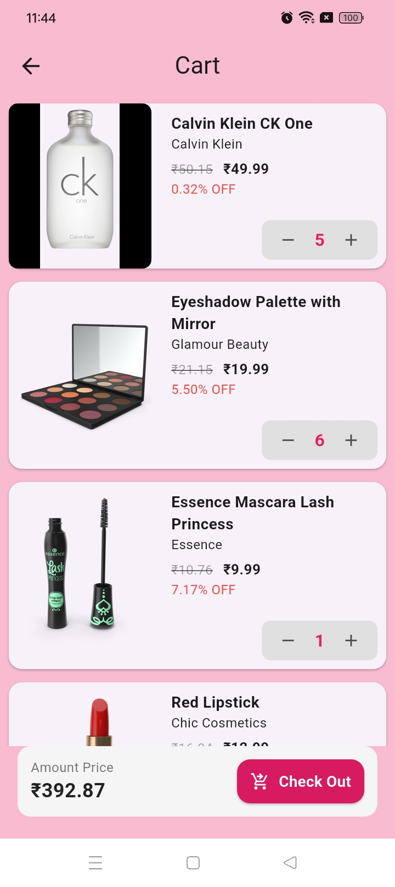

# 🛒 Shopping App with Bloc & Pagination

A simple shopping app built using **Flutter** and **Bloc (Cubit)** for state management. The app allows users to browse products, add/remove them from the cart, and dynamically update the cart summary. It also supports **pagination** to load more products.

---

## 🎯 **Features**

- Fetch products using [DummyJSON API](https://dummyjson.com/products)
- Add and remove items to/from the cart
- Real-time cart updates with total price calculation
- Product quantity management
- Infinite scroll with pagination
- Bloc (Cubit) for state management

---

## 📸 **Screenshots**

<p align="center">
  
</p>
*Home Screen with product listing.*

<p align="center">
  
</p>
*Cart Screen with total price and quantity.*th total price and quantity.*

---

## 🚀 **Getting Started**

### 1️⃣ **Clone the Repository**
```bash
git clone https://github.com/yourusername/shopping_app_assignment.git
```
### **Navigate to cloned directory OR **
```bash
cd shopping_app_assignment
```
### **Open in IDE OR**
```bash
code .
```
### **Run following command in terminal**
```bash
flutter clean
flutter pub get
```

### **Run app OR**
```bash
flutter run
```

